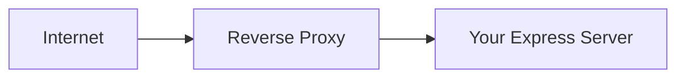
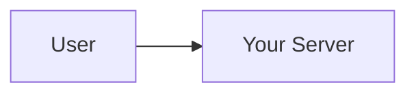
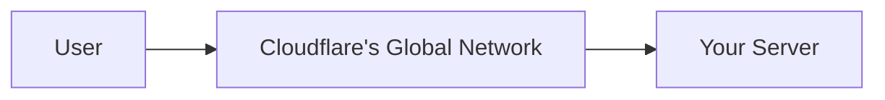

# What is firewall exactly?

So you know how your **house has a main gate?**

That gate has one job — decide **who comes in and who doesn't.**

A **firewall is exactly that gate, but for network traffic.**

---

Every time data travels on the internet, it travels in small chunks called **packets.** Your browser sends packets, your server receives packets, your server sends packets back.

A firewall sits at the entry point and **inspects every packet** coming in and going out — and based on rules, it either **allows** it or **drops** it.

---

## What Rules Does It Use?

Basic firewall rules look like this —

- Block all traffic coming from **this specific IP address**
- Allow traffic only on **port 443** (HTTPS), block everything else
- Block all traffic coming from **this country**
- Allow only **this specific IP range** to access the database

That's it. It's purely based on **where the traffic is coming from and going to.** Not what's inside it.

---

## The Simple Analogy

Imagine a **security guard at a society gate.**

He has a register — allowed flat numbers, blocked visitors, allowed timings.

He checks — *"are you on the allowed list? No? Get out."*

But here's the thing — **he doesn't check what's in your bag.** He just checks your identity and where you're going.

That's a firewall. Identity and destination based. Not content based.

The WAF we discussed — that's the guard who **also opens your bag and checks inside.**

Let's go! 🔥

---

## Floor 2 — How People Solved It Before Arcjet

So Floor 1 established the problem — your server is blind, it responds to everyone equally.

Now, people didn't just sit and accept that. Solutions were built. Let's walk through them one by one.

---

## Solution 1 — The Reverse Proxy

Imagine your Express server is a **celebrity.**

A celebrity doesn't talk to everyone directly. They have a **manager** who stands in front — filters calls, blocks randoms, only lets through legitimate people.

A **reverse proxy** is that manager.

It's a server that sits **in front of your actual server.** Every request hits the reverse proxy first. Then the proxy decides — forward it or block it.

**Nginx** is the most common reverse proxy. You've probably seen it mentioned somewhere.

But a basic reverse proxy is just a traffic forwarder — it doesn't have smart security built in by default. It can do some basic stuff like limiting connections, but it's not a security tool on its own.

---

## Solution 2 — The Firewall

You've heard "firewall" before I'm sure.

A traditional firewall works at the **network level.** It blocks or allows traffic based on simple rules like — block this IP address, block this port, allow only this country.

Think of it like a **bouncer with a basic blocklist.** If your name is on the list — you're out. If not — you're in.

The problem? It's too dumb for modern attacks.

A bot can just switch IP addresses. A firewall doesn't understand *what the request is doing* — it just sees where it's coming from.

---

## Solution 3 — WAF (Web Application Firewall)

This is where things get smarter.

A **WAF** is a firewall but specifically designed for **web traffic.** It doesn't just look at IP addresses — it actually inspects the **content of requests.**

It understands HTTP. It can detect things like —

- Someone trying SQL injection in a form field
- Suspicious patterns in request headers
- Known bot signatures
- Malformed requests

Think of it like upgrading from a bouncer with a blocklist to a bouncer who actually **reads what you're carrying** before letting you in.

**Cloudflare WAF** is the most popular one. AWS has one too called AWS WAF.

---

## So What Exactly Is Cloudflare Then?

Cloudflare is not just one thing — it's a **whole platform.** But the core idea is this —

When you use Cloudflare, you point your domain to Cloudflare's servers. So instead of:

It becomes:

Cloudflare sits in the middle. And from that position it can —

- Block malicious bots
- Rate limit abusive IPs
- Absorb DDoS attacks (they have massive infrastructure for this)
- Cache your content
- Provide WAF rules

It's like hiring a **massive security company** to guard your building. All traffic goes through their checkpoint first.

---

## Sounds Perfect — So Why Not Just Use Cloudflare?

Great question. And this is the key to understanding *why Arcjet exists.*

Cloudflare and WAFs have real limitations —

### **1. They're infrastructure-level, not code-level**

Cloudflare doesn't know anything about your application's logic. It doesn't know that `/api/classes` should only be accessible by a teacher role. It doesn't know that a user has already submitted 3 forms today. It just sees raw HTTP traffic.

Your **business logic lives in your code.** Cloudflare can never touch that.

### **2. Configuration lives in a dashboard, not your codebase**

Your security rules live in Cloudflare's dashboard — not in your Git repo. Which means —

- Your rules aren't version controlled
- A teammate can't review them in a PR
- They're disconnected from your actual application logic
- Deployment and security config are two separate things

### **3. Overkill and complexity for smaller apps**

Setting up Cloudflare properly for a PERN app involves DNS changes, certificate management, proxy configuration — it's a whole infrastructure setup. For a CV project or early stage app, that's a lot of overhead.

### **4. Vendor lock-in**

Your security is now dependent on Cloudflare's platform, pricing, and availability.

---

## The Gap That Exists

So here's where we land at the end of Floor 2 —

External tools like Cloudflare are **powerful but distant.** They protect the gate but they don't understand what's happening inside your rooms.

What's missing is something that —

- Lives **inside your codebase**
- Understands your **application logic**
- Is configured **in code, not a dashboard**
- Works at the **route level** — this specific endpoint, this specific rule

That gap is exactly what Arcjet fills. ☝️
