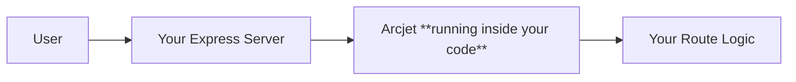
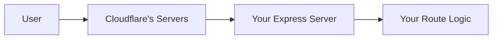
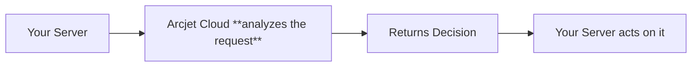

# Floor 3 — What Arcjet Actually Is

So we know —

- The problem exists (Floor 1)
- Old solutions exist but have gaps (Floor 2)

Now Arcjet enters. 🎯

---

## What Arcjet Is In One Clean Mental Model

Arcjet is a **security SDK** — meaning it's just an npm package you install.

But here's what makes it different from everything we discussed in Floor 2 —

It doesn't live outside your app. It doesn't live in a dashboard. It doesn't intercept traffic before it reaches you.

**It lives inside your Express routes and middleware — as actual code.**



Compare that to Cloudflare —



See the difference? Arcjet is **inside the building.** Cloudflare is **outside the building.**

---

## How Does Arcjet Actually Work Then?

When a request hits your Express route, you call Arcjet like this —

```js
const decision = await aj.protect(req);

if (decision.isDenied()) {
  return res.status(403).json({ error: "Blocked" });
}

// safe to continue
```

What happens in that `aj.protect(req)` call?

Arcjet looks at the incoming request and checks multiple things simultaneously —

- Is this IP making too many requests? **(Rate limiting)**
- Does this request look like it's coming from a bot? **(Bot detection)**
- Is this a known malicious IP? **(Shield protection)**
- Is this email a disposable/fake one? **(Email validation)**

It runs all these checks and comes back with a **decision** — allowed or denied.

You then act on that decision in your own code.

---

## Where Does The Intelligence Come From?

This is the part most tutorials never explain —

When you call `aj.protect(req)`, Arcjet doesn't just run everything locally on your server. It sends request metadata to **Arcjet's cloud decision engine.**



So it's a **hybrid** —

- The SDK lives in your code
- The intelligence and analysis lives in Arcjet's cloud
- The **decision and enforcement** happens back in your code

This is important because maintaining a global database of malicious IPs, known bot signatures, disposable email providers — that's massive infrastructure. You don't want that on your server. Arcjet maintains it for you.

---

## Why This Architecture Is Smart For Your Project

Remember your classroom dashboard has —

- A login route
- Teacher specific routes
- Admin specific routes
- Student specific routes
- Form submissions

With Arcjet you can protect **each route differently** — in code, right next to the route logic itself.

```js
// Login route — strict rate limiting
// Teacher route — bot protection
// Signup route — email validation
```

All of this is in your codebase. Version controlled. Reviewable in PRs. Readable by anyone who opens your project.

That's something Cloudflare simply cannot do. ☝️

---

## One Line Summary of All 3 Floors So Far

- **Floor 1** — Your server is blind, bad actors abuse that blindness
- **Floor 2** — External tools like Cloudflare guard the gate but don't understand your app
- **Floor 3** — Arcjet lives inside your code, understands your routes, and makes security decisions at the application level
