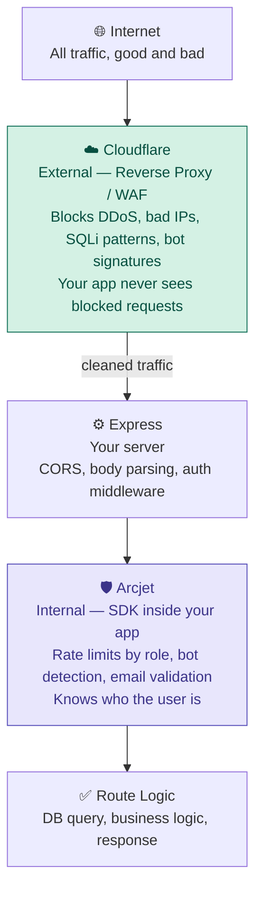

# 🏢 Floor 3 — Arcjet vs Cloudflare: Two Different Layers of Defense

## What is Arcjet, really?

Arcjet is an **SDK** — a library you `npm install` into your Express app. It runs *inside your process*, in the same memory, on the same machine. When a request hits your `/api/students` route, Arcjet gets to inspect it *before* your route handler runs.

The key thing to burn into your memory:

> **Arcjet has access to everything your app knows.** The user's role, their session, which tenant they belong to — because it runs *inside your app*.

That's the fundamental difference from Cloudflare. Now let me show you that architecturally.

## The Full Architecture — Where Each Layer Lives(Click any box to go deeper on that layer!)

## What Cloudflare blocks — *without your app even waking up*

Think of Cloudflare like a bouncer at the building gate, before anyone even reaches your reception desk. It blocks things it can identify from the *outside*:

**DDoS attacks** — Someone sends 500,000 requests per second from a botnet. Cloudflare absorbs it at their edge (they have massive global infrastructure). Your Express server never even sees the flood.

**Known bad IPs** — Cloudflare maintains reputation databases. If an IP is flagged as a Tor exit node, a known scanner, or a previously identified attacker, it gets dropped before touching your server.

**Attack signatures** — Things that look like `SELECT * FROM users WHERE 1=1--` in a URL parameter, or `` in a form field. WAF rules (Web Application Firewall) pattern-match these at the edge.

**Bot signatures** — Headless browsers without proper JS environments, crawlers that don't respect robots.txt, scrapers making inhuman request patterns.

The beautiful thing: **your server pays zero compute cost** for any of this. Cloudflare stops it 500ms before it ever reaches Render/Heroku/wherever you're hosted.

## What Cloudflare *cannot* block — and why

Here's where it gets interesting, yaar. Cloudflare is working blind to your *application's context*. It only sees the HTTP request. It doesn't know:

- Who is logged in
- What role they have (teacher vs student vs admin)
- Whether this is their 5th API call or their 500th *today*
- Whether the email `johndoe@gmail.com` was just used to create 3 fake accounts

So Cloudflare **cannot** protect you from:

**Authenticated user abuse** — A logged-in teacher hammering `GET /api/students` 1000 times in a minute. To Cloudflare, this is a valid request with a valid session. Arcjet can say "this userId has exceeded 100 requests/minute."

**Per-role rate limits** — You want to allow admins 500 req/min but students only 50. Cloudflare has no idea what role a user has. Arcjet can read the role from your JWT and apply different limits.

**Fake signups with real-looking emails** — `temp-mailbox123@mailinator.com` is technically a valid HTTP POST to `/api/register`. Cloudflare has no reason to block it. Arcjet's email validation detects it's a disposable email and rejects it.

**Multi-step form abuse** — Someone writes a script that:

1. Gets a classroom invite link
2. Creates an account
3. Joins the classroom
4. Immediately exports student data

Each individual request looks fine to Cloudflare. Only Arcjet (with your business logic context) can say "Step 3→4 in under 2 seconds is suspicious."

## Why you might want *both* — defense in depth

This is the mental model to use in interviews:

> "Cloudflare handles the volume problem. Arcjet handles the context problem."

They're not competing — they're complementary. A classroom dashboard with both layers looks like this:

- 10,000 bot requests? → Cloudflare kills them at the edge. Arcjet never runs.
- 1 authenticated teacher abusing the bulk-export endpoint? → Cloudflare lets it through (looks legit). Arcjet catches it.
- Fake student signup with a disposable email? → Cloudflare has no opinion. Arcjet says no.
- SQL injection attempt in a URL param? → Cloudflare's WAF blocks it before Express even boots.

Neither layer alone is complete.

---

## Trade-off table — the honest comparison

| | Cloudflare | Arcjet |
|---|---|---|
| **Where it runs** | Their edge servers globally | Inside your Express process |
| **What it knows** | IP, headers, raw request, patterns | User identity, role, session, business context |
| **Latency added** | Near-zero (usually 1-3ms) | Small (5-15ms per protected route) |
| **Cost** | Free tier generous; paid for advanced WAF | Free tier available; paid for higher volume |
| **Config complexity** | Dashboard UI, some learning curve | Code — feels like middleware |
| **False positives** | Higher risk (blocks legit users by IP region, VPN, etc.) | Lower risk (you control the rules explicitly in code) |
| **Debugging difficulty** | Harder — logs are on their platform, not yours | Easier — you can `console.log` the Arcjet decision |
| **Handles DDoS** | Yes — designed for it | No — if 50k requests hit your server, Arcjet runs 50k times |
| **Handles business logic** | No | Yes — that's literally its job |
