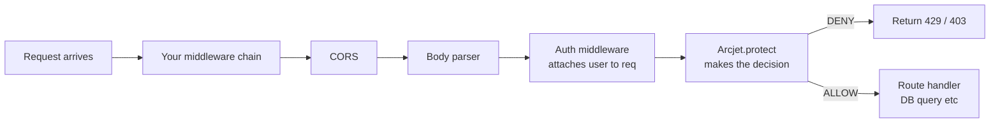
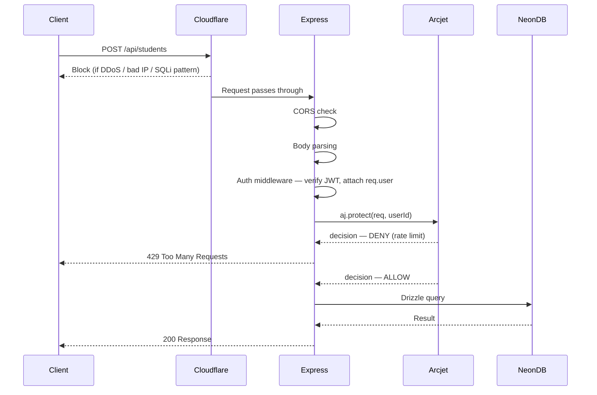

# Floor 5 — DEEP

But before the code, let me make sure the mental foundation is solid. Because if you just copy-paste Arcjet middleware without understanding *why* each decision was made, you won't be able to explain it in an interview.

---

## How Arcjet Actually Sits in Express — The Real Mental Model

You already know Express middleware. A request comes in, it passes through a chain of functions, each one can either call `next()` or kill the request. Arcjet is just another function in that chain — but instead of being a simple function you wrote, it's a function that calls Arcjet's cloud service, gets a verdict, and then either lets the request through or kills it.



Notice where Arcjet sits — **after** auth middleware. This is intentional and important. Auth runs first so that by the time Arcjet runs, `req.user` already exists. Arcjet can then use `req.user.id` or `req.user.role` as part of its decision. If Arcjet ran before auth, it would only see an anonymous request with no context.

---

## The `protect()` call — what actually happens

When you call `aj.protect(req)`, Arcjet doesn't just pattern-match locally. It:

1. Extracts fingerprint data from the request — IP, user-agent, headers, timing
2. Sends this to Arcjet's cloud service
3. Arcjet's service checks it against your configured rules AND its global threat intelligence (shared data across all Arcjet users — if an IP attacked someone else's app yesterday, it already knows)
4. Returns a decision object back to your server in ~5-15ms

This is why Arcjet is more powerful than just writing your own rate limiting with a Redis counter. The global threat intelligence is something you'd never build yourself.

The decision object looks roughly like:

```ts
{
  conclusion: "DENY",          // or "ALLOW"
  reason: {
    isRateLimit: true,         // which rule triggered
    isBot: false,
    isShield: false,
  },
  ttl: 30,                     // seconds until they can try again
}
```

---

## Rate Limiting — going deeper

You saw the token bucket in Floor 4. Let me explain why the algorithm matters.

**The naive approach** — a simple counter. "Allow 10 requests per minute. Reset counter at the top of every minute." The problem: a user sends 10 requests at 12:00:59, counter resets at 12:01:00, they send 10 more immediately. You just got 20 requests in 2 seconds. This is called the **fixed window problem**.

**Sliding window** — instead of resetting at a fixed clock time, you look at the last 60 seconds from *right now*. Better, but more memory-intensive.

**Token bucket** — what Arcjet uses. Conceptually:

- You have a bucket with a capacity (say 20 tokens)
- Tokens refill at a steady rate (say 10 per minute)
- Each request costs 1 token
- If bucket is empty → denied
- Bucket never exceeds capacity — you can't "save up" more than the max

Why is this better? It handles **burst traffic naturally**. A teacher who hasn't touched the app in 2 hours has a full bucket. They can make 20 quick requests (loading a dashboard with multiple API calls) without being blocked. But a script making 200 requests in a loop drains the bucket immediately and gets blocked.

Now the critical thing for your classroom dashboard — **what you use as the identifier for rate limiting**.

```ts
// Bad — rate limit by IP
// Problem: shared office WiFi means all teachers share one IP
// One teacher's burst blocks all others
tokenBucket({
  characteristics: ["ip.src"]
})

// Good — rate limit by authenticated user ID
// Each teacher gets their own bucket
tokenBucket({
  characteristics: ["userId"]   // from your JWT
})

// Best for multi-role — different limits per role
// But this requires separate Arcjet instances or conditional logic
// covered below
```

---

## Bot Protection — going deeper

The word "bot" sounds simple but there's a spectrum:

```text
Googlebot → Monitoring tools → Scrapers → Credential stuffers → DDoS bots
(good)                                                            (bad)
```

Arcjet doesn't just say "bot or not bot." It gives you categories so you can make nuanced decisions. The way it detects bots:

**User-Agent analysis** — obvious bots announce themselves (`python-requests/2.28`, `curl/7.68`). But sophisticated bots fake a Chrome user-agent. So UA alone is not enough.

**Header completeness** — a real browser sends 15-20 headers in a specific order. A script typically sends 3-5. Arcjet checks the full header set and the order.

**Request timing** — real humans have variable timing between requests. Bots are often perfectly uniform (every 500ms, exactly). Arcjet looks at timing patterns across multiple requests.

**JavaScript challenge** — for browser-facing routes, Arcjet can issue a JS challenge. Real browsers pass it silently. Scripts that don't execute JS fail it. Headless browsers like Puppeteer can pass it but leave other fingerprints.

Why does this matter for your classroom dashboard specifically? Your `/api/auth/login` is a prime target for **credential stuffing** — bots that take username/password lists from data breaches and try them systematically. They use real Chrome user-agents, they have some timing variation — but Arcjet's combination of signals catches most of them. Without any bot protection, your login endpoint will eventually be in someone's attack script.

---

## Shield — going deeper

Shield is Arcjet's WAF layer. To understand what it's doing, you need to understand what it's protecting against.

**SQL Injection** — an attacker puts SQL syntax into your input fields hoping it gets concatenated into a query:

```rest
GET /api/students?classId=1 OR 1=1--
```

If your query is built like `WHERE class_id = ${req.query.classId}`, that `OR 1=1` returns every student in the database. Drizzle ORM actually protects you from this by using parameterized queries — but Shield catches the attempt before it even reaches your route, and logs it. You now know someone is actively probing your app.

**Path traversal** — an attacker tries to read files outside your app directory:

```rest
GET /api/files/../../etc/passwd
```

**XSS payloads** — someone tries to store `<script>document.cookie</script>` as a student name, hoping it gets rendered unsanitized later.

Shield pattern-matches against a continuously updated ruleset. You don't write these patterns — Arcjet maintains them. This is the same value proposition as Cloudflare's WAF, except Shield runs inside your process and has access to your parsed request body (not just raw bytes like Cloudflare sees).

---

## Email Validation — going deeper

When someone registers on your classroom dashboard, you want to know three things:

**Is the format valid?** — `notanemail` should fail immediately. This you could do with a regex. Arcjet does it too, but this isn't the interesting part.

**Does the domain actually exist and accept email?** — Arcjet does a live DNS MX record lookup. `fakeschool@nonexistentdomain.xyz` passes format validation but has no MX record. The email could never be delivered. Without this check, you're storing dead emails.

**Is it a disposable email?** — Services like Mailinator, Guerrilla Mail, Temp Mail give users a throwaway inbox. Students use these to create multiple accounts, bypass bans, or fake signups. Arcjet maintains a list of thousands of known disposable domains and blocks them.

The subtle thing — this isn't just about sending emails. In a classroom dashboard, fake accounts pollute your data. A teacher sees "30 students enrolled" but 10 of them are throwaway accounts that'll never come back. Arcjet's email validation is data quality protection, not just communication quality protection.

---

## Multi-Role Rate Limiting — the real pattern for your app

Your classroom dashboard has at least three roles: admin, teacher, student. You don't want the same limits for all of them. Here's how you'd actually structure this:

```ts
// Create separate Arcjet instances per role
const adminAj = arcjet({
  key: process.env.ARCJET_KEY,
  rules: [
    shield({ mode: "LIVE" }),
    tokenBucket({
      mode: "LIVE",
      refillRate: 100,
      interval: 60,
      capacity: 200,
      characteristics: ["userId"]
    })
  ]
})

const teacherAj = arcjet({
  key: process.env.ARCJET_KEY,
  rules: [
    shield({ mode: "LIVE" }),
    tokenBucket({
      mode: "LIVE",
      refillRate: 30,
      interval: 60,
      capacity: 60,
      characteristics: ["userId"]
    })
  ]
})

const studentAj = arcjet({
  key: process.env.ARCJET_KEY,
  rules: [
    shield({ mode: "LIVE" }),
    tokenBucket({
      mode: "LIVE",
      refillRate: 10,
      interval: 60,
      capacity: 20,
      characteristics: ["userId"]
    })
  ]
})
```

Then in your middleware:

```ts
export const arcjetProtect = async (req, res, next) => {
  const role = req.user?.role  // set by your auth middleware earlier

  const aj = role === "admin" 
    ? adminAj 
    : role === "teacher" 
    ? teacherAj 
    : studentAj

  const decision = await aj.protect(req, { userId: req.user?.id })

  if (decision.isDenied()) {
    if (decision.reason.isRateLimit()) {
      return res.status(429).json({ error: "Too many requests" })
    }
    if (decision.reason.isBot()) {
      return res.status(403).json({ error: "Automated requests not allowed" })
    }
    if (decision.reason.isShield()) {
      return res.status(403).json({ error: "Request blocked" })
    }
  }

  next()
}
```

---

## Where This Middleware Goes in Your Route Files

```ts
// routes/students.ts
router.get(
  "/students",
  authenticate,        // 1. verify JWT, attach req.user
  arcjetProtect,       // 2. Arcjet uses req.user.role and req.user.id
  StudentController.getAll  // 3. only reaches here if allowed
)

// routes/auth.ts
router.post(
  "/register",
  validateEmailArcjet,   // special Arcjet instance with email validation rule
  AuthController.register
)
```

Note that `/register` doesn't need `authenticate` before Arcjet — the user isn't logged in yet. Here Arcjet uses IP as the identifier, and its job is email validation + bot protection, not role-based rate limiting.

---

## The Full Request Lifecycle in Your App



---

## What You'd Tell an Interviewer

If someone asks "how does your app handle security," you walk them through exactly this diagram. Two layers — Cloudflare handles volumetric and known-signature attacks before your server even wakes up. Arcjet handles business-logic-aware protection inside your app — per-user rate limits based on role, bot detection on auth endpoints, email validation on registration, and Shield as a second WAF layer for anything Cloudflare missed. Each layer does what only it can do.
