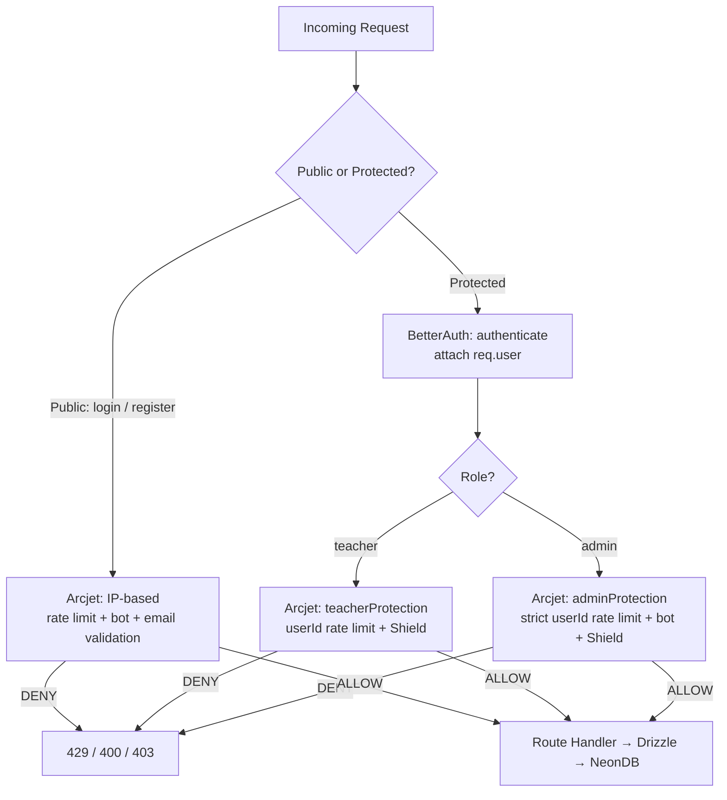

# Floor 5 — Arcjet in Your Classroom Dashboard

## Your App's Reality First

Before writing a single line of Arcjet code, let's map what your app actually looks like from a security perspective.

You have:

- **BetterAuth** handling sessions and JWT
- **Multiple roles** — admin, teacher, student
- **Sensitive endpoints** — student lists, classroom data, bulk exports
- **Public endpoints** — register, login
- **Drizzle + NeonDB** on the backend
- **Express** as the server

The question isn't "how do I add Arcjet" — it's "which endpoint has which threat, and what Arcjet rule answers that threat."

---

## Threat Mapping — Your Routes

| Route | Who hits it | Threats | Arcjet rules needed |
|---|---|---|---|
| `POST /api/auth/register` | Anyone | Fake emails, bot signups, bulk account creation | Email validation, bot protection, Shield |
| `POST /api/auth/login` | Anyone | Credential stuffing, brute force | Rate limit by IP, bot protection, Shield |
| `GET /api/students` | Teacher, Admin | Authenticated scraping, role abuse | Rate limit by userId + role, Shield |
| `GET /api/classrooms` | Teacher, Admin | Same as above | Rate limit by userId + role, Shield |
| `POST /api/classrooms` | Teacher, Admin | Spam creation, bot abuse | Rate limit by userId, bot protection, Shield |
| `DELETE /api/students/:id` | Admin only | Abuse of privileged action | Strict rate limit, Shield |
| `GET /api/export` | Admin only | Data harvesting | Very strict rate limit, bot protection, Shield |

Shield goes on everything — no exceptions.

---

## Project Structure for Arcjet

```text
src/
  arcjet/
    client.ts          ← single Arcjet client setup
    instances.ts       ← separate instances per use case
    middleware.ts      ← reusable Express middleware functions
  routes/
    auth.ts
    students.ts
    classrooms.ts
```

Keeping Arcjet in its own folder means when you need to update a rule, you update it in one place — not scattered across every route file.

---

## Step 1 — The Base Client

```ts
// src/arcjet/client.ts
import arcjet from "@arcjet/node"

export const aj = arcjet({
  key: process.env.ARCJET_KEY!,
  // characteristics declared here apply globally
  // you can override per instance
})
```

This is just the base. You don't use this directly in routes — you extend it into specific instances.

---

## Step 2 — Purpose-Built Instances

```ts
// src/arcjet/instances.ts
import { aj } from "./client"
import { shield, tokenBucket, botProtection, validateEmail } from "@arcjet/node"

// For login — brute force + bot protection
// Rate limit by IP because user is not authenticated yet
export const loginProtection = aj.withRule(
  shield({ mode: "LIVE" })
).withRule(
  botProtection({ mode: "LIVE", allow: [] })
).withRule(
  tokenBucket({
    mode: "LIVE",
    refillRate: 5,       // 5 attempts
    interval: 60,        // per minute
    capacity: 5,
    characteristics: ["ip.src"]  // by IP — no user yet
  })
)

// For register — fake email + bot + flood protection
export const registerProtection = aj.withRule(
  shield({ mode: "LIVE" })
).withRule(
  validateEmail({
    mode: "LIVE",
    block: ["DISPOSABLE", "INVALID", "NO_MX_RECORDS"]
  })
).withRule(
  botProtection({ mode: "LIVE", allow: [] })
).withRule(
  tokenBucket({
    mode: "LIVE",
    refillRate: 3,
    interval: 60,
    capacity: 3,
    characteristics: ["ip.src"]
  })
)

// For teacher-accessible data endpoints
export const teacherProtection = aj.withRule(
  shield({ mode: "LIVE" })
).withRule(
  tokenBucket({
    mode: "LIVE",
    refillRate: 30,
    interval: 60,
    capacity: 60,
    characteristics: ["userId"]   // per authenticated user
  })
)

// For admin-only sensitive endpoints
export const adminProtection = aj.withRule(
  shield({ mode: "LIVE" })
).withRule(
  botProtection({ mode: "LIVE", allow: [] })
).withRule(
  tokenBucket({
    mode: "LIVE",
    refillRate: 10,
    interval: 60,
    capacity: 20,
    characteristics: ["userId"]
  })
)
```

Each instance has a clear job. `loginProtection` doesn't know about emails. `registerProtection` doesn't need role-based limits. This separation makes your code readable and your rules auditable.

---

## Step 3 — The Middleware Functions

```ts
// src/arcjet/middleware.ts
import { Request, Response, NextFunction } from "express"
import {
  loginProtection,
  registerProtection,
  teacherProtection,
  adminProtection
} from "./instances"

// Generic handler — takes any Arcjet instance and runs it
const runArcjet = async (
  instance: typeof loginProtection,
  req: Request,
  res: Response,
  next: NextFunction,
  extra?: Record<string, string>
) => {
  const decision = await instance.protect(req, extra)

  if (decision.isDenied()) {
    if (decision.reason.isRateLimit()) {
      return res.status(429).json({
        error: "Too many requests. Please slow down."
      })
    }
    if (decision.reason.isBot()) {
      return res.status(403).json({
        error: "Automated requests are not allowed."
      })
    }
    if (decision.reason.isEmail()) {
      return res.status(400).json({
        error: "Invalid or disposable email address."
      })
    }
    // Shield or anything else
    return res.status(403).json({
      error: "Request blocked."
    })
  }

  next()
}

// Exported middleware — one per use case
export const protectLogin = (req: Request, res: Response, next: NextFunction) =>
  runArcjet(loginProtection, req, res, next)

export const protectRegister = (req: Request, res: Response, next: NextFunction) =>
  runArcjet(registerProtection, req, res, next)

// These two need userId from BetterAuth — passed as extra context
export const protectTeacherRoute = (req: Request, res: Response, next: NextFunction) =>
  runArcjet(teacherProtection, req, res, next, { userId: req.user?.id ?? req.ip })

export const protectAdminRoute = (req: Request, res: Response, next: NextFunction) =>
  runArcjet(adminProtection, req, res, next, { userId: req.user?.id ?? req.ip })
```

The `extra` object is how you pass `userId` to Arcjet. When you declared `characteristics: ["userId"]` in the token bucket, Arcjet looks for it here. If `req.user.id` doesn't exist for some reason, it falls back to IP — so you never crash.

---

## Step 4 — BetterAuth + Arcjet Together

BetterAuth attaches the session to `req.user` after verifying the JWT. Your middleware order must be:


If Arcjet runs before BetterAuth, `req.user` is undefined and you lose your userId-based rate limiting.

```ts
// src/routes/students.ts
import { Router } from "express"
import { authenticate } from "../middleware/auth"         // BetterAuth middleware
import { protectTeacherRoute, protectAdminRoute } from "../arcjet/middleware"
import { StudentController } from "../controllers/student"

const router = Router()

// Teacher and admin can get student list
router.get(
  "/",
  authenticate,
  protectTeacherRoute,
  StudentController.getAll
)

// Only admin can delete
router.delete(
  "/:id",
  authenticate,
  protectAdminRoute,
  StudentController.delete
)

export default router
```

```ts
// src/routes/auth.ts
import { Router } from "express"
import { protectLogin, protectRegister } from "../arcjet/middleware"
import { AuthController } from "../controllers/auth"

const router = Router()

// No authenticate here — user isn't logged in yet
router.post("/login", protectLogin, AuthController.login)
router.post("/register", protectRegister, AuthController.register)

export default router
```

---

## Step 5 — Role-Based Routing at the Router Level

Your classroom dashboard has a pattern where some routes are accessible to both teachers and admins but with different limits. The cleanest way to handle this without duplicating routes:

```ts
// src/middleware/roleGuard.ts
import { Request, Response, NextFunction } from "express"
import { protectTeacherRoute, protectAdminRoute } from "../arcjet/middleware"

export const protectByRole = (req: Request, res: Response, next: NextFunction) => {
  if (req.user?.role === "admin") {
    return protectAdminRoute(req, res, next)
  }
  return protectTeacherRoute(req, res, next)
}
```

Now in your routes:

```ts
router.get(
  "/classrooms",
  authenticate,
  protectByRole,    // picks the right Arcjet instance based on role
  ClassroomController.getAll
)
```

One route. Role-aware protection. Clean.

---

## Step 6 — Environment-Aware Mode

You don't want Arcjet actually blocking requests during development. Use `DRY_RUN` in dev:

```ts
// src/arcjet/instances.ts
const mode = process.env.NODE_ENV === "production" ? "LIVE" : "DRY_RUN"

export const loginProtection = aj.withRule(
  shield({ mode })
).withRule(
  tokenBucket({ mode, refillRate: 5, interval: 60, capacity: 5, characteristics: ["ip.src"] })
)
```

In `DRY_RUN`, Arcjet runs every check and logs what it *would* have done — but never actually blocks. You can test your rules in dev without locking yourself out.

---

## The Full Picture


