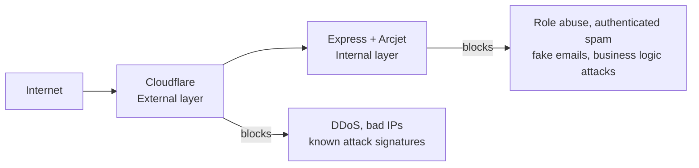

# Floor 6 — Interview Confidence

## The One-Line Answer for "What is Arcjet?"

> "Arcjet is a security SDK that runs inside your application — it gives you rate limiting, bot protection, and request validation with full access to your app's business context like user roles and session data."

If they ask you to expand, you go to the two-layer model.

---

## The Two-Layer Model — Your Core Answer for Any Security Question

Any interviewer question about security in your project gets answered with this model first. Then you zoom into whichever layer they're asking about.

---

## Questions They'll Actually Ask

### **"Why did you use Arcjet instead of just writing your own rate limiter?"**

A custom rate limiter with Redis gives you a counter. Arcjet gives you a counter plus global threat intelligence — if an IP attacked a completely different app yesterday, Arcjet already knows about it. It also gives you bot detection, email validation, and Shield in one SDK. Building all of that yourself is weeks of work that has nothing to do with your actual product.

---

### **"How does Arcjet know who the user is?"**

It doesn't automatically — you tell it. BetterAuth runs first, verifies the JWT, and attaches `req.user` to the request. Then when Arcjet's `protect()` runs, you pass `{ userId: req.user.id }` as extra context. Arcjet uses that as the identifier for rate limiting — so each user has their own token bucket, not shared with anyone else.

---

### **"What's the difference between Arcjet Shield and Cloudflare WAF?"**

Same concept, different position in the architecture. Cloudflare WAF runs at the edge — before your server even receives the request, so your server pays zero compute cost for blocked attacks. Arcjet Shield runs inside your process — it can inspect your parsed request body, not just raw bytes. If you have both, Cloudflare handles the volume and Arcjet is a second check for anything that slipped through.

---

### **"What happens if Arcjet's cloud service goes down?"**

This is a great question to raise yourself — shows maturity. Arcjet has a fail-open policy by default, meaning if it can't reach its service, it allows the request through rather than blocking everything. You can configure this. In a classroom dashboard, fail-open makes sense — blocking all legitimate teachers because Arcjet had a 30-second outage is worse than briefly losing protection.

---

### **"Why is your rate limit per userId and not per IP?"**

Because in a school context, an entire campus might share one IP address. Rate limiting by IP means one student's burst behavior blocks every other student and teacher on that network. Per-userId means each person has their own independent bucket — their behavior doesn't affect anyone else.

---

### **"What is DRY_RUN mode and why does it matter?"**

DRY_RUN lets you deploy Arcjet to production without it actually blocking anyone. It runs every check and logs what it would have done, but allows the request through. This is how you validate your rules against real traffic before flipping to LIVE. It's the same idea as a feature flag for security rules — you don't just turn on a firewall rule in production without testing it first.

---

### **"How did you handle different security rules for different roles?"**

You created separate Arcjet instances — `teacherProtection` and `adminProtection` — each with different token bucket limits. Then a `protectByRole` middleware reads `req.user.role` after authentication and picks the appropriate instance. One route, role-aware protection, no duplicated route handlers.

---

### **"What is credential stuffing and how does your app handle it?"**

Credential stuffing is when an attacker takes a list of leaked username/password pairs from a data breach and tries them against your login endpoint systematically. The requests look legitimate — real browser headers, valid email formats. Arcjet handles it in two ways: bot detection catches scripts that don't have proper browser fingerprints, and IP-based rate limiting on the login route means even a sophisticated bot gets locked out after 5 failed attempts per minute.

---

### **"What is a token bucket?"**

A token bucket is a rate limiting algorithm where each user gets a bucket with a maximum capacity. Tokens refill at a steady rate over time. Each request costs one token. If the bucket is empty, the request is denied. The advantage over a simple per-minute counter is that it handles bursts naturally — a user who hasn't made requests in a while has a full bucket and can make several quick requests without being penalized, which is normal human behavior. A script making hundreds of requests in a loop drains the bucket immediately.

---

### **"Why put Shield on every route?"**

Because SQL injection, XSS, and path traversal attempts don't target one specific endpoint — attackers probe everything. Shield is computationally cheap, maintained by Arcjet so you don't manage the ruleset, and the cost of not having it on one route is that that route becomes the weak point. There's no reason to selectively apply it.

---

## The Mistake Most Candidates Make

They describe what a tool does. You describe *why you made each decision*.

Not: "Arcjet does rate limiting."

But: "I chose per-userId rate limiting over per-IP because a school campus shares a single IP, and I didn't want one student's behavior affecting everyone else's session."

The second answer shows you thought about your actual use case, not just the docs.

---

## Your Full Security Story in 60 Seconds

> "My app has two security layers. Cloudflare sits outside my server and handles volumetric attacks — DDoS, known bad IPs, SQL injection patterns in URLs. My server never sees those requests.
>
> Inside Express, I use Arcjet. It runs after BetterAuth authenticates the user, so it has full context — who the user is, what their role is. I have separate Arcjet instances for different roles: teachers get a 30 requests per minute bucket, admins get more, students get less. My login endpoint has IP-based rate limiting and bot detection to stop credential stuffing. Registration has email validation to block disposable emails and fake signups. Shield runs on every route as a second WAF layer.
>
> The two layers do different jobs — Cloudflare handles what it can see from the outside, Arcjet handles what only my app's context can see."

That's your answer. Confident, structured, tied to real decisions.
